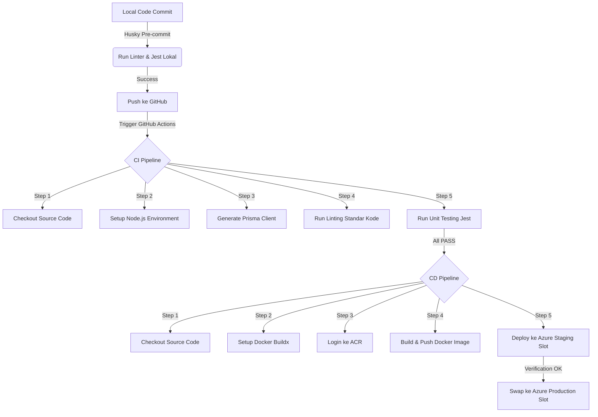

# 🚀 PANDUAN GLADI BERSIH & KESIAPAN DEMO DEVOPS QURBAN MMI
### *Prepared with ❤️ by Antigravity for Kelompok 5 - PSO C (Bara, Raihan, Annisa, Fika)*

Yo! Biar besok di depan asdos kita bisa presentasi dengan lancar jaya, nge-flex coverage murni 100%, dan topologi Git yang cakep, tim wajib khatam panduan super interaktif ini! 🔥

---

## 📖 GLOSARIUM TOOLS (Bahasa Santai & Gen Z)

*   **Git & GitHub**: Kapsul waktu kode kita. Mengatur percabangan fitur biar nggak tabrakan antar developer.
*   **Husky**: *Satpam pre-commit*. Dia otomatis jalanin linter dan testing di lokal sebelum kita commit. Kalau ada yang error, commit langsung ditolak! Nggak ada lagi drama kode rusak masuk repo.
*   **Jest (Testing Framework)**: Mesin uji otomatis kita. Dia bertugas nembakin 68 test cases buat ngecek fungsi logika backend/frontend tanpa perlu ngeklik manual satu-satu.
*   **Prisma ORM**: Jembatan gaul antara kode Next.js kita dengan database Supabase PostgreSQL. Tinggal panggil fungsi, data langsung masuk!
*   **NextAuth**: Sistem pengamanan pintu masuk (auth). Dia ngecek session dan mastiin cuma user dengan role `"ADMIN"` yang bisa update status hewan qurban. User ilegal/non-admin langsung ditendang! 🔐
*   **Docker & Dockerfile**: Kontainerisasi. Membungkus aplikasi beserta seluruh konfigurasinya ke dalam satu "kotak" terstandarisasi biar bisa jalan di server mana pun tanpa error *“but it works on my machine”*.
*   **Azure Container Registry (ACR)**: Gudang penyimpanan image Docker kita yang sudah dibuild di awan.
*   **Azure App Service & Slot Deployment**: Rumah aplikasi kita di awan. Menggunakan trik **Staging Slot** (tempat uji kelayakan) dan **Production Slot** (halaman aktif). Begitu staging dinyatakan sehat, kita tinggal *swap* instan tanpa ada downtime sama sekali!

---

## 🔄 ALUR PIPELINE CI/CD KITA (The Flow)

---

## 🌳 ARSITEKTUR GIT PARALEL (Silsilah Kapsul Waktu)

Biar asdos terpesona dengan demo penggabungan fitur kita, kita bikin topologi Git non-linear (paralel) yang mantap:

*   **`archive/before-feature`**: Branch masa lalu yang bercabang langsung dari commit purba **`3cf3731`** (kondisi polosan sebelum ada fitur tracking), tapi sudah membawa file pipeline DevOps yang baru agar Next.js tidak error saat build.
*   **`archive/final-feature`**: Branch masa depan yang memuat seluruh fitur tracking lengkap, pengujian komprehensif, dan pengamanan autentikasi 100% lulus uji.
*   **Simulasi Demo**: Besok pas live demo, kita tinggal tunjukkan branch *before*, lalu lakukan `git merge archive/final-feature` untuk menyimulasikan merger fitur baru dan melihat pipa CI/CD berputar otomatis hingga deploy ke Azure!

---

## 🎯 TARGET METRICS KITA (Flexing Section)

> [!IMPORTANT]
> Jangan lupa sebutkan angka-angka keramat ini di depan asdos:
> *   **Total Test Cases**: **68 unit tests** murni **PASS** semuanya (100% Sukses).
> *   **All Files Target Coverage**: **100% Statement Coverage & Line Coverage** murni untuk seluruh file logika aplikasi kita (`hewan.ts`, `pengqurban.ts`, `permohonan-online.ts`, `petugas.ts`, `/api/track/route.ts`, dan `utils/tracking.ts`).

---

## ❓ KISI-KISI TANYA JAWAB ASDOS (FAQ)

> [!TIP]
> **Q: Kenapa status pemrosesan hewan dibatasi enum "MENUNGGU", "DISEMBELIH", dan "DIDISTRIBUSIKAN"?**
> *   **A**: Biar ada konsistensi data di database dan mencegah input sampah (invalid status). Kami sudah mengujinya di `security.test.ts` untuk memastikan Server Action langsung menolak input di luar enum tersebut dengan aman.
> 
> **Q: Bagaimana kalian memastikan API pelacakan publik `/api/track` tidak membocorkan data pribadi shohibul?**
> *   **A**: Pertama, kami menerapkan *data masking* pada nomor telepon shohibul (menyensor bagian tengah nomor telepon berdasarkan panjang karakternya). Kedua, kami menyaring properti sensitif panitia (seperti `biaya_operasional`, `bukti_bayar`, `keterangan`, `sebab`, dan `uang`) sehingga tidak pernah dikirim ke browser client. Pengujian ini ter-cover 100% di `route.test.ts`.
> 
> **Q: Mengapa kalian menggunakan Slot Deployment di Azure?**
> *   **A**: Supaya proses deployment aman dari downtime. Aplikasi baru dideploy ke staging slot dulu untuk verifikasi (smoke test). Jika sudah dipastikan jalan lancar, Azure melakukan proses *slot swap* secara instan ke production slot tanpa memutus koneksi pengguna aktif.
