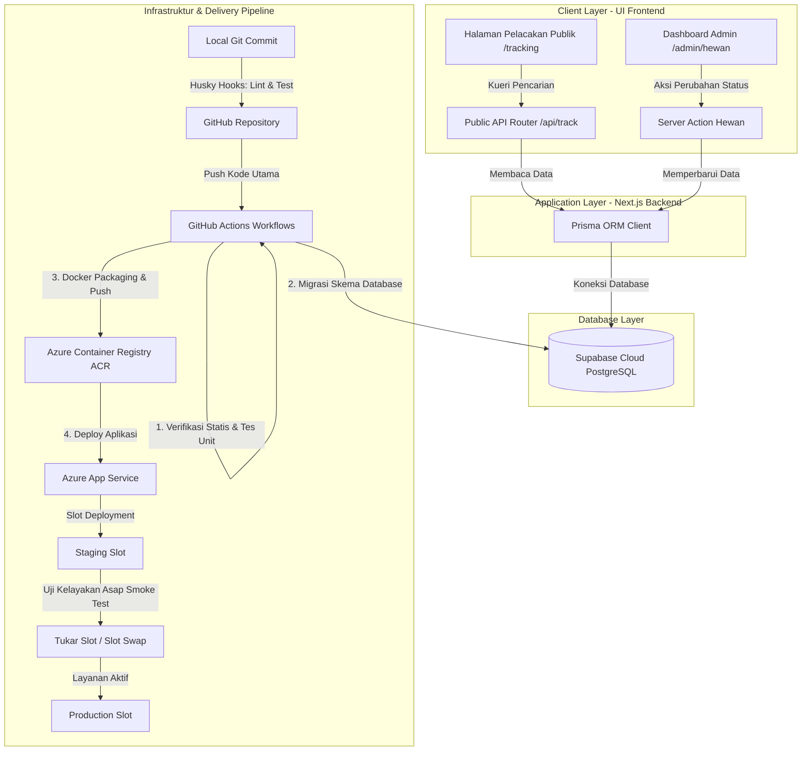

# PRODUCT REQUIREMENTS DOCUMENT (PRD)
## Fitur: Real-Time Status Tracking Pendaftar & Hewan Qurban
### Website Administrasi Qurban Masjid Manarul Ilmi (MMI) ITS

### Dokumen Metadata
- **Status**: PROPOSED
- **Target Audience**: Kelompok 5 - PSO C (Bara, Raihan, Annisa, Fika)
- **Terakhir Diperbarui**: 2026-06-02

---

## 1. Overview & Objective

### 1.1 Latar Belakang
Masjid Manarul Ilmi (MMI) ITS mengelola pendataan dan ibadah qurban setiap tahunnya secara intensif. Saat ini, sistem administrasi qurban berbasis web telah mengintegrasikan alur pendataan mulai dari menu data pengqurban, data hewan qurban, pendaftaran online via form, hingga pendataan petugas jaga.

Namun, satu tantangan utama yang dihadapi adalah kurangnya visibilitas real-time bagi para shohibul qurban (pendaftar/peserta qurban) mengenai status pendaftaran, status pembayaran, serta status pemrosesan hewan qurban mereka. Shohibul qurban sering kali harus menghubungi panitia secara manual untuk mengetahui apakah hewan qurban mereka sudah disembelih atau kapan daging qurban didistribusikan.

### 1.2 Tujuan Fitur (Feature Objectives)
Fitur **"Status Tracking Pendaftar & Hewan Qurban"** dirancang untuk memenuhi beberapa tujuan utama:
1. **Transparansi & Akuntabilitas**: Memberikan visibilitas penuh secara real-time kepada shohibul qurban mengenai status pembayaran qurban dan tahap pemrosesan hewan qurban mereka (dari persiapan hingga distribusi).
2. **Kemudahan Akses**: Menyediakan portal pencarian publik yang intuitif dan aman, di mana peserta qurban dapat melacak status qurban hanya dengan memasukkan Nomor Kontak/Telepon, NKW (Nomor Kartu Warga/Pengqurban), atau ID Hewan tanpa harus login ke dashboard admin.
3. **Pipeline Validasi CI/CD**: Berfungsi sebagai instrumen uji coba utama untuk menguji efektivitas dan keandalan pipeline CI/CD yang diimplementasikan. Penambahan fitur ini membutuhkan perubahan terintegrasi di seluruh lapisan sistem (skema database, API Backend, pengujian, dan UI Frontend) yang akan divalidasi oleh otomatisasi pipeline.

---

## 2. Tech Stack & Architecture

Berikut adalah arsitektur tingkat tinggi dari aliran data fitur pelacakan status dan perannya dalam alur integrasi serta pengantaran berkelanjutan (CI/CD):



### 2.1 Deskripsi Teknis Komponen Sistem
- **Frontend Layer**: Menggunakan Next.js (App Router) berbasis React. Antarmuka pelacakan memanfaatkan Tailwind CSS untuk tata letak responsif, Lucide React sebagai penyedia ikon status, dan Animate On Scroll (AOS) untuk transisi elemen visual yang interaktif.
- **Backend & Logic Layer**: Memanfaatkan Next.js Server Actions untuk penanganan perintah perubahan data terautentikasi oleh admin, dan Next.js API Routes (Route Handlers) untuk melayani permintaan pencarian status publik.
- **Database & Data Access Layer**: Menggunakan basis data relasional PostgreSQL yang di-host di Supabase. Interaksi dengan basis data ditangani menggunakan kueri terstruktur melalui Prisma ORM dengan konfigurasi pooler transaksi untuk efisiensi kueri runtime dan pooler sesi untuk keperluan migrasi skema.

### 2.2 Arsitektur Infrastruktur & Pipeline CI/CD
- **Version Control**: Kode program dikelola secara kolaboratif melalui platform GitHub.
- **Pre-Commit Quality Gate**: Menggunakan Husky untuk mengotomatisasi pemeriksaan kualitas kode (linting) dan eksekusi tes unit di lingkungan lokal sebelum pengembang melakukan commit.
- **Otomatisasi CI/CD**: Diatur menggunakan GitHub Actions yang secara bertahap menjalankan pengujian, build, migrasi database, dan deployment.
- **Containerization & Registry**: Menggunakan Docker untuk membungkus aplikasi Next.js ke dalam image container terstandarisasi, yang disimpan secara aman di Azure Container Registry (ACR).
- **Deployment Platform**: Azure App Service Linux dengan konfigurasi Slot Deployment untuk mendukung rilis tanpa downtime:
  - **Staging Slot**: Lingkungan perantara tempat image Docker baru dideploy untuk verifikasi awal dan uji kelayakan otomatis.
  - **Production Slot**: Lingkungan langsung (live) yang melayani pengguna akhir. Setelah staging slot terverifikasi sehat, sistem akan melakukan proses pertukaran slot (slot swap) secara instan tanpa mengganggu sesi pengguna aktif.

---

## 3. Feature Specifications

### 3.1 Spesifikasi Skema Database (Database Schema)
Untuk mendukung pelacakan status penanganan hewan qurban, sistem memerlukan perluasan penyimpanan data pada entitas hewan qurban.

#### Kebutuhan Perubahan Data:
1. **Atribut Baru pada Entitas Hewan Qurban**:
   - Menambahkan field untuk status pemrosesan hewan (misal: `status_hewan`).
   - Tipe Data: String (untuk fleksibilitas migrasi dan kompatibilitas sistem).
   - Nilai Default: `"MENUNGGU"` (menandakan hewan baru terdaftar dan siap di kandang penampungan).
   - Batasan Nilai (Enum Logis): Hanya boleh menerima salah satu dari tiga nilai status:
     - `MENUNGGU` (Waiting): Hewan siap di lokasi penampungan.
     - `DISEMBELIH` (Slaughtered): Hewan sedang/telah disembelih secara syar'i.
     - `DIDISTRIBUSIKAN` (Distributed): Daging qurban telah dikemas dan dikirim ke penerima manfaat.

#### Alur Migrasi Database pada Pipeline:
- Setiap perubahan pada skema database harus didefinisikan melalui file migrasi SQL lokal yang dihasilkan oleh perkakas ORM.
- Pipeline CI/CD bertanggung jawab menjalankan file migrasi tersebut secara otomatis ke Supabase PostgreSQL menggunakan koneksi langsung (direct connection) sebelum container aplikasi baru diaktifkan di server staging/produksi.

---

### 3.2 Spesifikasi API Backend & Server Actions
Backend harus menyediakan gerbang pertukaran data yang aman dan terstruktur baik untuk publik maupun untuk kebutuhan internal pengurus.

#### 1. API Pelacakan Publik (GET `/api/track`)
Endpoint ini digunakan secara terbuka oleh pengunjung halaman pelacakan untuk mencari data qurban.
- **Input / Parameter**: Menerima kueri pencarian berbasis teks (seperti Nomor Kontak Shohibul, NKW, atau ID Hewan).
- **Logika Bisnis & Validasi**:
  - Validasi keberadaan kueri; jika kueri kosong, kembalikan status error permintaan tidak valid (HTTP 400).
  - Melakukan pencarian data pada entitas hewan qurban dan entitas pengqurban terkait yang memiliki kecocokan data.
  - Jika tidak ada data yang cocok, kembalikan status error data tidak ditemukan (HTTP 404).
- **Keamanan & Privasi Data**:
  - Endpoint **wajib** melakukan penyensoran (masking) pada data sensitif sebelum dikirim ke klien.
  - Nomor telepon shohibul qurban harus disensor sebagian (misal: menampilkan 4 digit awal dan 4 digit akhir, sementara digit tengah digantikan karakter bintang).
  - Data internal non-publik lainnya tidak boleh diikutkan dalam respon API.

#### 2. Mekanisme Pembaruan Status Admin (Server Action)
Fungsi internal terproteksi yang digunakan oleh panitia atau petugas di dashboard administrasi untuk mengubah tahapan proses hewan.
- **Input / Parameter**: Menerima ID unik hewan qurban dan nilai status baru yang valid (`MENUNGGU` / `DISEMBELIH` / `DIDISTRIBUSIKAN`).
- **Logika Bisnis**:
  - Melakukan validasi hak akses pengguna (hanya admin/staf terautentikasi yang diizinkan).
  - Melakukan pembaruan field status hewan qurban di database.
  - Memicu pembersihan tembolok (cache revalidation) pada halaman pelacakan publik agar perubahan data langsung terlihat seketika oleh shohibul qurban.

---

### 3.3 Spesifikasi UI Frontend
Antarmuka pengguna harus didesain dengan visual yang bersih, intuitif, responsif, serta memberikan umpan balik interaktif (micro-animations) untuk meningkatkan pengalaman pengguna.

#### 1. Portal Pelacakan Publik (Halaman `/tracking`)
Halaman ini dapat diakses secara bebas tanpa memerlukan login.
- **Komponen Kotak Pencarian (Search Bar)**:
  - Menyediakan form input teks yang jelas untuk memasukkan parameter pelacakan.
  - Dilengkapi tombol aksi pencarian dengan efek transisi aktif.
- **Umpan Balik Status Pencarian (State Management)**:
  - **Loading State**: Menampilkan ikon putar (spinner) atau animasi penahan tempat (skeleton loading) saat data sedang dimuat dari API.
  - **Error/Empty State**: Menampilkan pesan informatif yang ramah jika pencarian tidak membuahkan hasil atau terjadi kendala jaringan.
- **Visualisasi Stepper Pelacakan (Tracking Stepper Component)**:
  - Jika pencarian berhasil, tampilkan informasi shohibul qurban (nama dan nomor telepon yang disensor) serta detail hewan.
  - Sediakan representasi visual interaktif berbentuk garis alur proses (stepper) yang menggambarkan 3 tahapan pemrosesan hewan qurban:
    1. **Hewan Tersedia (Menunggu)**: Menunjukkan hewan siap di lokasi penampungan.
    2. **Penyembelihan**: Menunjukkan proses penyembelihan sedang berlangsung atau selesai.
    3. **Distribusi**: Menunjukkan daging siap/sedang disalurkan.
  - Gunakan indikator warna dinamis berdasarkan status hewan saat ini:
    - Langkah yang sudah terlewati berwarna hijau kokoh.
    - Langkah yang sedang aktif berkedip lembut (pulse animation) dengan warna kontras (misal: kuning/amber).
    - Langkah mendatang berwarna abu-abu redup.
  - Tampilkan lencana (badge) terpisah untuk menegaskan status pembayaran hewan qurban tersebut (LUNAS, DP, atau BELUM LUNAS).

#### 2. Kontrol Pembaruan Status di Dashboard Admin
Integrasi komponen interaktif pada panel administrasi untuk memudahkan pengurus mengelola tahapan hewan secara massal atau individu.
- **Komponen Pemilih Status (Dropdown Selector)**:
  - Disediakan pada baris data tabel hewan qurban di dashboard admin.
  - Menampilkan pilihan status hewan saat ini dan opsi untuk mengubahnya ke tahapan berikutnya.
  - Aksi perubahan memicu pemanggilan mekanisme pembaruan status backend dan menampilkan notifikasi sukses/gagal yang melayang (toast notification) secara instan di layar admin.

---

## 4. CI/CD Validation Scenarios

Fitur tracking ini bertindak sebagai alat validasi komprehensif bagi keandalan sistem integrasi dan pengantaran berkelanjutan (CI/CD) tim pengembang.

### 4.1 Uji Kualitas Lokal (Local Quality Gates)
Sebelum kode baru didorong ke repositori bersama, pengembang harus lolos verifikasi lokal:
- **Husky Git Hook**: Pemicu otomatis sebelum commit dilakukan. Hook akan menjalankan perkakas pengecekan gaya penulisan kode (linter) dan perkakas tes unit secara lokal. Jika ditemukan error atau kegagalan tes, proses commit otomatis dibatalkan untuk menjaga kebersihan repositori.
- **Tes Unit Lokal (Jest)**: Pengujian unit difokuskan untuk memverifikasi kebenaran logika pembagian status stepper (fungsi pembagi warna aktif/tidak aktif), logika penyensoran nomor telepon, dan penanganan respon HTTP pada API pelacakan.

### 4.2 Alur Otomatisasi GitHub Actions (Pipeline Workflow)
Ketika kode didorong ke cabang utama (main atau staging), GitHub Actions akan menjalankan workflow otomatisasi dengan tahapan berurutan:

```
[Trigger Push]
      │
      ▼
┌───────────────────────────────────────────────┐
│ Stage 1: Continuous Integration (CI)          │
│ 1. Unduh repositori & siapkan cache modul     │
│ 2. Jalankan Linter kode                       │
│ 3. Jalankan validasi skema ORM Prisma         │
│ 4. Eksekusi Unit Test otomatis                │
└──────────────────────┬────────────────────────┘
                       │ (Lolos Uji CI)
                       ▼
┌───────────────────────────────────────────────┐
│ Stage 2: Continuous Deployment (CD)           │
│ 1. Eksekusi migrasi database ke Supabase      │
│ 2. Build image aplikasi ke dalam Docker       │
│ 3. Push image Docker ke Azure Registry (ACR)  │
│ 4. Deploy image baru ke Azure Staging Slot    │
└──────────────────────┬────────────────────────┘
                       │ (Deploy Sukses)
                       ▼
┌───────────────────────────────────────────────┐
│ Stage 3: Verification & Release               │
│ 1. Jalankan Smoke Test otomatis pada URL      │
│    Staging Slot                               │
│ 2. Lakukan Slot Swap ke Production Slot       │
│ 3. Pengguna mengakses fitur secara langsung   │
└───────────────────────────────────────────────┘
```

#### Deskripsi Tahapan Pipeline:
1. **Continuous Integration (CI)**:
   - Runner mengunduh kode terbaru, menyiapkan runtime, dan menginstal dependensi menggunakan metode cache agar proses berjalan cepat.
   - Menjalankan analisis statis kode dan validasi integritas skema relasi ORM.
   - Menjalankan pengujian otomatis. Kegagalan pada tahap ini akan menghentikan seluruh pipeline dan mengirim notifikasi kegagalan kepada tim.

2. **Database Migration & Dockerization**:
   - Setelah tes lolos, pipeline akan mengeksekusi migrasi database Supabase secara aman menggunakan perkakas migrasi bawaan ORM.
   - Aplikasi dikemas ke dalam image Docker mandiri yang efisien dan memiliki tag unik berbasis ID commit (SHA). Image ini didorong ke Azure Container Registry (ACR).

3. **Staging Slot Deployment**:
   - Azure App Service menarik image Docker terbaru dari ACR dan mengaktifkannya di dalam **Staging Slot** (lingkungan terisolasi yang tidak dapat diakses publik umum).

4. **Automated Smoke Testing**:
   - Pipeline menjalankan kueri pengujian otomatis berupa pemanggilan curl atau HTTP request ke URL khusus Staging Slot untuk memastikan endpoint pelacakan status (`/api/track`) merespon dengan benar dan database terkoneksi dengan sehat.

5. **Slot Swapping (Zero-Downtime)**:
   - Jika smoke test berhasil, Azure diperintahkan untuk melakukan pertukaran slot staging menjadi slot produksi secara instan.
   - Proses ini menjamin tidak ada gangguan akses bagi pengguna aktif (zero-downtime) dan meminimalkan resiko kegagalan rilis fitur di lingkungan produksi.
