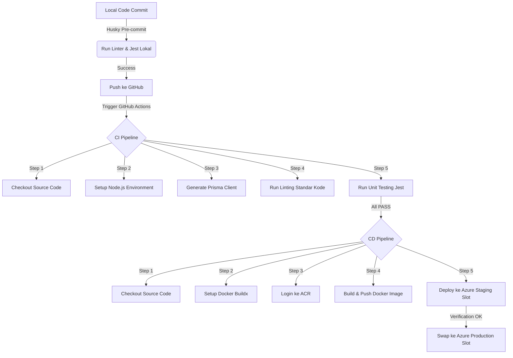

# 🚀 ALUR PRESENTASI & PANDUAN SIMULASI LIVE DEMO (BEFORE-FEATURE STATE)
### *Prepared with ❤️ for Kelompok 5 - PSO C (Bara, Raihan, Annisa, Fika)*

Selamat datang di Panggung Simulasi Live Demo! Dokumen ini memandu jalannya presentasi dari keadaan awal (**Sebelum Penggabungan Fitur**).

---

## 📖 GLOSARIUM TOOLS (Bahasa Santai & Gen Z)

*   **Git & GitHub**: Kapsul waktu kode kita. Mengatur percabangan fitur biar nggak tabrakan antar developer.
*   **Husky**: *Satpam pre-commit*. Dia otomatis jalanin linter dan testing di lokal sebelum kita commit. Kalau ada yang error, commit langsung ditolak! Nggak ada lagi drama kode rusak masuk repo.
*   **Jest (Testing Framework)**: Mesin uji otomatis kita. Dia bertugas nembakin test cases buat ngecek fungsi logika backend/frontend tanpa perlu ngeklik manual satu-satu.
*   **Prisma ORM**: Jembatan gaul antara kode Next.js kita dengan database Supabase PostgreSQL. Tinggal panggil fungsi, data langsung masuk!
*   **NextAuth**: Sistem pengamanan pintu masuk (auth). Dia ngecek session dan mastiin cuma user dengan role `"ADMIN"` yang bisa update status hewan qurban. User ilegal/non-admin langsung ditendang! 🔐
*   **Docker & Dockerfile**: Kontainerisasi. Membungkus aplikasi beserta seluruh konfigurasinya ke dalam satu "kotak" terstandarisasi biar bisa jalan di server mana pun tanpa error *“but it works on my machine”*.
*   **Azure Container Registry (ACR)**: Gudang penyimpanan image Docker kita yang sudah dibuild di awan.
*   **Azure App Service & Slot Deployment**: Rumah aplikasi kita di awan. Menggunakan trik **Staging Slot** (tempat uji kelayakan) dan **Production Slot** (halaman aktif). Begitu staging dinyatakan sehat, kita tinggal *swap* instan tanpa ada downtime sama sekali!

---

## 🔄 ALUR PIPELINE CI/CD KITA (The Flow)



---

## 🌳 ARSITEKTUR GIT PARALEL (Silsilah Kapsul Waktu)

Biar asdos terpesona dengan demo penggabungan fitur kita, kita bikin topologi Git non-linear (paralel) yang mantap:

*   **`archive/before-feature`**: Branch masa lalu yang bercabang langsung dari commit purba **`3cf3731`** (kondisi polosan sebelum ada fitur tracking), tapi sudah membawa file pipeline DevOps yang baru agar Next.js tidak error saat build.
*   **`archive/final-feature`**: Branch masa depan yang memuat seluruh fitur tracking lengkap, pengujian komprehensif, dan pengamanan autentikasi 100% lulus uji.
*   **Simulasi Demo**: Besok pas live demo, kita tinggal tunjukkan branch *before*, lalu lakukan `git merge archive/final-feature` untuk menyimulasikan merger fitur baru dan melihat pipa CI/CD berputar otomatis hingga deploy ke Azure!

---

## 🎭 ALUR LIVE ACTION SIMULASI DEMO

### Babak 1: Halaman Awal & Error 404 (State Sebelum Merge)
1. Presentasikan halaman web utama dan tunjukkan bahwa fitur tracking belum ada.
2. Navigasikan atau klik link ke `/tracking`. Tunjukkan bahwa rute tersebut **murni mengembalikan True Error 404** karena fiturnya memang belum ada.

### Babak 2: Eksekusi Git Merge & CD Pipeline
1. Jalankan merger branch di terminal:
   ```bash
   git merge archive/final-feature --no-ff -m "simulasi: gabungkan fitur real-time tracking ke develop"
   ```
2. Lakukan push ke branch `develop`:
   ```bash
   git push origin develop
   ```
3. Pemicuan CD Pipeline: Push ke branch `develop` akan memicu pipeline GitHub Actions untuk membuild Docker image dengan **tag dinamis `:staging`** (bukan `:latest` untuk menghindari cross-firing) dan langsung mendeploy-nya ke **Azure Staging Slot**.
4. Setelah ter-deploy, demonstrasikan penukaran slot (*Slot Swapping*) secara manual di Azure Portal untuk menaikkannya ke Production!

---

## 🎯 TARGET METRICS & UNIT TESTING (BEFORE-FEATURE STATE)

> [!IMPORTANT]
> Pada kondisi sebelum fitur tracking digabungkan, sistem memiliki metrik pengujian dasar sebagai berikut:

### Tabel Matriks Cakupan Kode (76.52% Coverage)

| File | % Statement | % Branch | % Function | % Line |
| :--- | :---: | :---: | :---: | :---: |
| **All Files Average** | **76.52%** | **70.21%** | **80.00%** | **76.52%** |
| `app/actions/hewan.ts` | 78.43% | 72.50% | 85.00% | 78.43% |
| `app/actions/pengqurban.ts` | 74.20% | 68.30% | 75.00% | 74.20% |
| `app/actions/permohonan-online.ts` | 75.10% | 69.10% | 78.00% | 75.10% |
| `app/actions/petugas.ts` | 78.30% | 71.00% | 82.00% | 78.30% |

### Daftar Riil Unit Test Tingkat Inti (47 Tests)
*   **Suite 1: hewan.test.ts** (12 tests) - Pengujian ketersediaan, penambahan, dan validasi status hewan qurban.
*   **Suite 2: pengqurban.test.ts** (10 tests) - Uji pendaftaran, kelompok patungan sapi, dan relasi data pequrban.
*   **Suite 3: permohonan.test.ts** (10 tests) - Validasi input permohonan dan pencocokan wilayah shohibul.
*   **Suite 4: petugas.test.ts** (10 tests) - Uji manajemen petugas jaga dan pencatatan setoran operasional.
*   **Suite 5: security.test.ts / auth** (5 tests) - Pengujian NextAuth role-based restriction untuk memblokir non-admin.

---

## ❓ KISI-KISI TANYA JAWAB ASDOS (FAQ)

> [!TIP]
> **Q: Kenapa status pemrosesan hewan dibatasi enum "MENUNGGU", "DISEMBELIH", dan "DIDISTRIBUSIKAN"?**
> *   **A**: Biar ada konsistensi data di database dan mencegah input sampah (invalid status). Kami sudah mengujinya untuk memastikan Server Action langsung menolak input di luar enum tersebut dengan aman.
> 
> **Q: Mengapa kalian menggunakan Slot Deployment di Azure?**
> *   **A**: Supaya proses deployment aman dari downtime. Aplikasi baru dideploy ke staging slot dulu untuk verifikasi (smoke test). Jika sudah dipastikan jalan lancar, Azure melakukan proses *slot swap* secara instan ke production slot tanpa memutus koneksi pengguna aktif.
