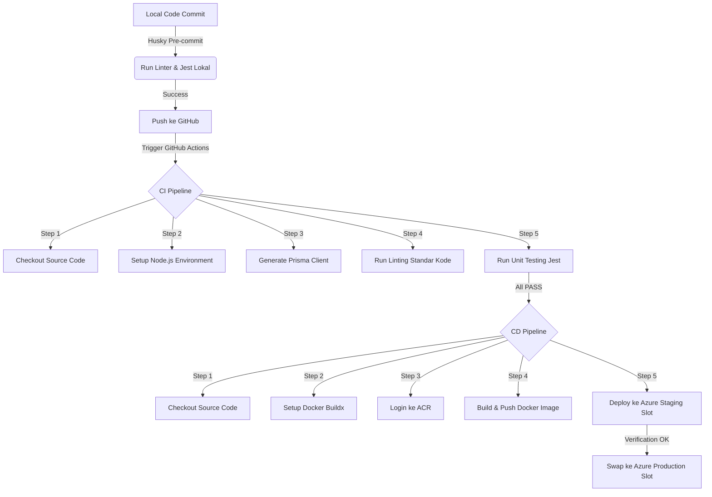

# 🚀 ALUR PRESENTASI & PANDUAN SIMULASI LIVE DEMO (FINAL STATE)
### *Prepared with ❤️ for Kelompok 5 - PSO C (Bara, Raihan, Annisa, Fika)*

Selamat datang di Panggung Simulasi Live Demo! Dokumen ini memandu jalannya presentasi dari keadaan akhir (**Setelah Penggabungan Fitur Sukses**).

---

## 📖 GLOSARIUM TOOLS (Bahasa Santai & Gen Z)

*   **Git & GitHub**: Kapsul waktu kode kita. Mengatur percabangan fitur biar nggak tabrakan antar developer.
*   **Husky**: *Satpam pre-commit*. Dia otomatis jalanin linter dan testing di lokal sebelum kita commit. Kalau ada yang error, commit langsung ditolak! Nggak ada lagi drama kode rusak masuk repo.
*   **Jest (Testing Framework)**: Mesin uji otomatis kita. Dia bertugas nembakin 68 test cases buat ngecek fungsi logika backend/frontend tanpa perlu ngeklik manual satu-satu.
*   **Prisma ORM**: Jembatan gaul antara kode Next.js kita dengan database Supabase PostgreSQL. Tinggal panggil fungsi, data langsung masuk!
*   **NextAuth**: Sistem pengamanan pintu masuk (auth). Dia ngecek session dan mastiin cuma user dengan role `"ADMIN"` yang bisa update status hewan qurban. User ilegal/non-admin langsung ditendang! 🔐
*   **Docker & Dockerfile**: Kontainerisasi. Membungkus aplikasi beserta seluruh konfigurasinya ke dalam satu "kotak" terstandarisasi biar bisa jalan di server mana pun tanpa error *“but it works on my machine”*.
*   **Azure Container Registry (ACR)**: Gudang penyimpanan image Docker kita yang sudah dibuild di awan.
*   **Azure App Service & Slot Deployment**: Rumah aplikasi kita di awan. Menggunakan trik **Staging Slot** (tempat uji kelayakan) dan **Production Slot** (halaman aktif). Begitu staging dinyatakan sehat, kita tinggal *swap* instan tanpa ada downtime sama sekali!

---

## 🔄 ALUR PIPELINE CI/CD KITA (The Flow)



---

## 🌳 ARSITEKTUR GIT PARALEL (Silsilah Kapsul Waktu)

Biar asdos terpesona dengan demo penggabungan fitur kita, kita bikin topologi Git non-linear (paralel) yang mantap:

*   **`archive/before-feature`**: Branch masa lalu yang bercabang langsung dari commit purba **`3cf3731`** (kondisi polosan sebelum ada fitur tracking), tapi sudah membawa file pipeline DevOps yang baru agar Next.js tidak error saat build.
*   **`archive/final-feature`**: Branch masa depan yang memuat seluruh fitur tracking lengkap, pengujian komprehensif, dan pengamanan autentikasi 100% lulus uji.
*   **Simulasi Demo**: Besok pas live demo, kita tinggal tunjukkan branch *before*, lalu lakukan `git merge archive/final-feature` untuk menyimulasikan merger fitur baru dan melihat pipa CI/CD berputar otomatis hingga deploy ke Azure!

---

## 🎭 ALUR LIVE ACTION SIMULASI DEMO

### Babak 1: Halaman Awal & Error 404 (State Sebelum Merge)
1. Presentasikan halaman web utama dan tunjukkan bahwa fitur tracking belum ada.
2. Navigasikan atau klik link ke `/tracking`. Tunjukkan bahwa rute tersebut **murni mengembalikan True Error 404** karena fiturnya memang belum ada.

### Babak 2: Eksekusi Git Merge & CD Pipeline
1. Jalankan merger branch di terminal:
   ```bash
   git merge archive/final-feature --no-ff -m "simulasi: gabungkan fitur real-time tracking ke develop"
   ```
2. Lakukan push ke branch `develop`:
   ```bash
   git push origin develop
   ```
3. Pemicuan CD Pipeline: Push ke branch `develop` akan memicu pipeline GitHub Actions untuk membuild Docker image dengan **tag dinamis `:staging`** (bukan `:latest` untuk menghindari cross-firing) dan langsung mendeploy-nya ke **Azure Staging Slot**.
4. Setelah ter-deploy, demonstrasikan penukaran slot (*Slot Swapping*) secara manual di Azure Portal untuk menaikkannya ke Production!

---

## 🎯 TARGET METRICS & UNIT TESTING (FINAL STATE)

> [!IMPORTANT]
> Pada kondisi akhir setelah fitur tracking terintegrasi, kita berhasil mencapai kualitas pengujian dengan metrik mutlak:
> *   **Total Pengujian**: **9 Test Suites** dengan **68 Tests** murni **PASS** semuanya (100% Sukses).
> *   **Cakupan Kode**: **100% Statement Coverage & Line Coverage** murni untuk seluruh file logika inti aplikasi.

### Tabel Matriks Cakupan Kode (100% Coverage)

| File | % Statement | % Branch | % Function | % Line |
| :--- | :---: | :---: | :---: | :---: |
| **All Files Average** | **100.00%** | **91.66%** | **100.00%** | **100.00%** |
| `app/actions/hewan.ts` | 100.00% | 92.30% | 100.00% | 100.00% |
| `app/actions/pengqurban.ts` | 100.00% | 91.66% | 100.00% | 100.00% |
| `app/actions/permohonan-online.ts` | 100.00% | 98.11% | 100.00% | 100.00% |
| `app/actions/petugas.ts` | 100.00% | 100.00% | 100.00% | 100.00% |
| `app/api/track/route.ts` | 100.00% | 59.09% | 100.00% | 100.00% |
| `app/utils/tracking.ts` | 100.00% | 100.00% | 100.00% | 100.00% |

### Daftar Riil Unit Test Tingkat Inti (68 Tests)

Berikut adalah rincian utuh dan granular dari **9 Test Suites** dan **68 Test Cases** riil menggunakan framework **Jest**:

#### 1. `app/actions/hewan.test.ts` (Suite: `Hewan Server Actions` - 14 Tests)
*   **createHewan**
    *   `should successfully create a new sheep and generate receipt if payment is set`: Menguji pendaftaran kambing dengan uang yang secara otomatis membuat kuitansi taktis baru dan memicu revalidatePath.
    *   `should increment kambing sequence ID based on existing lastHewan`: Menguji kenaikan urutan angka ID kambing berdasar pendaftar terakhir (misal dari `14471002` ke `14471003`).
    *   `should calculate next sequence for sapi utuh correctly from existing sapi`: Memastikan nomor urutan kelompok sapi utuh dihitung secara benar dari database.
    *   `should catch kuitansi creation error and still return success true for animal creation`: Memastikan jika terjadi error di pembuatan kuitansi, proses registrasi hewan qurban utama tetap berjalan sukses.
    *   `should return success false on database error`: Menguji respon penanganan error ketika Prisma database mengalami kegagalan/koneksi terputus.
*   **updateHewan**
    *   `should update animal details successfully`: Memverifikasi pembaruan data detail hewan qurban (misalnya perubahan bentuk pembayaran atau uang).
    *   `should return error if update fails`: Menguji penanganan kegagalan kueri update database.
*   **deleteHewan**
    *   `should successfully delete the animal qurban`: Memverifikasi penghapusan data hewan qurban dan memicu revalidasi antarmuka.
    *   `should return error if delete fails`: Menguji penanganan kegagalan saat proses penghapusan data di basis data.
*   **getHewanQurban**
    *   `should retrieve animals and handle sapi patungan groups`: Memastikan data hewan dapat ditarik dan dikelompokkan secara terstruktur berdasarkan kelompok sapi patungan.
    *   `should set penyaluran to 'Campuran (Internal & Luar)' if group members have different values`: Memastikan status penyaluran kelompok sapi diset "Campuran" jika ada anggota kelompok yang menyalurkan secara internal dan luar.
    *   `should return empty array on failure`: Menguji kembalian array kosong saat terjadi kegagalan pengambilan data hewan.
*   **getStatistikSapiPatungan**
    *   `should return group stats and suggest next slot group`: Menghitung kuota kelompok sapi patungan dan menyarankan kelompok aktif yang masih kurang dari 7 orang.
    *   `should handle error in getStatistikSapiPatungan`: Menguji respon ketika kalkulasi statistik mengalami kegagalan kueri.

#### 2. `app/actions/pengqurban.test.ts` (Suite: `Pengqurban Server Actions` - 10 Tests)
*   **getPengqurban**
    *   `should retrieve pengqurban data successfully with parameters`: Memverifikasi penarikan data pengqurban berdasarkan query nama dan tahun Hijriah.
    *   `should return empty array and success false on database failure`: Menangani kegagalan kueri penarikan data.
*   **createPengqurban**
    *   `should successfully create new pengqurban if NKW is unique`: Menguji pembuatan data pendaftar baru jika NKW belum terdaftar dengan parsing no urut.
    *   `should return error if NKW is already registered`: Menolak pembuatan data pengqurban baru jika NKW yang diinput sudah ada di database.
    *   `should return success false on database exceptions`: Menangani error crash tak terduga pada basis data saat pembuatan.
*   **updatePengqurban**
    *   `should update pengqurban details successfully`: Memverifikasi pembaruan informasi detail profil pengqurban (nama/nomor kontak).
    *   `should return success false if database update fails`: Menangani error crash database saat pembaruan profil.
*   **deletePengqurban**
    *   `should successfully delete the pengqurban`: Memverifikasi penghapusan data pendaftar.
    *   `should handle relational dependency failure (error P2003)`: Memastikan penghapusan ditolak dan memberikan info relevan jika pengqurban masih terikat dengan hewan qurban.
    *   `should handle generic delete errors`: Menangani error crash generik saat penghapusan.

#### 3. `app/actions/permohonan-online.test.ts` (Suite: `Permohonan Online Server Actions` - 12 Tests)
*   **submitPermohonanOnline**
    *   `should successfully submit permohonan online`: Menguji pendaftaran mandiri oleh shohibul secara online beserta data hewan dan bukti transfer.
    *   `should handle error in submitPermohonanOnline`: Menangani kegagalan input registrasi online.
*   **getPermohonanOnline**
    *   `should retrieve permohonan online list and format dates and currency`: Menguji penampilan list pendaftar online beserta formatting tanggal ISO.
    *   `should handle error in getPermohonanOnline`: Menangani kegagalan kueri penarikan daftar online.
*   **verifyPermohonan**
    *   `should decline permohonan successfully when action is DITOLAK`: Menguji fungsi verifikator menolak pengajuan online.
    *   `should return success false if permohonan is not found`: Menguji penanganan verifikasi jika ID permohonan tidak valid/tidak ada.
    *   `should return success false if permohonan is already ACC`: Mencegah verifikasi ulang untuk permohonan yang statusnya sudah disetujui.
    *   `should clean non-digits from previous NKW when generating a new NKW`: Menguji pembersihan karakter non-angka (seperti `/`) pada NKW sebelumnya untuk penambahan urutan numerik.
    *   `should handle existing sapi sequences correctly and assign animal sequences correctly`: Menguji penentuan urutan no ID sapi baru pada proses ACC.
    *   `should suggest next group for sapi patungan and build new group if preceding is full`: Memetakan shohibul sapi patungan ke kelompok yang masih kosong/belum penuh (maksimal 7 slot) secara otomatis.
    *   `should set lastUrutan sequence increment for non-sapi animal`: Menguji penambahan urutan nomor ID secara berurutan untuk multi-kambing pendaftar.
    *   `should return success false and catch database transaction errors`: Memastikan pembatalan/rollback transaksi database secara aman jika terjadi error di tengah jalan saat verifikasi.

#### 4. `app/actions/petugas.test.ts` (Suite: `Petugas Server Actions` - 9 Tests)
*   **createPetugas**
    *   `should successfully create a new volunteer with incremented sequence id`: Menguji pembuatan petugas jaga baru dengan pembuatan ID berurutan secara otomatis.
    *   `should handle creating volunteer when no previous volunteer exists`: Menguji inisialisasi ID pertama jika belum ada petugas jaga terdaftar.
    *   `should return success false on database errors during creation`: Menangani kegagalan kueri saat pembuatan data.
*   **getPetugasJaga**
    *   `should retrieve list of volunteers successfully`: Menguji pencarian data petugas jaga aktif.
    *   `should return empty array on database failure`: Menangani kegagalan kueri pencarian data.
*   **updatePetugas**
    *   `should update volunteer info successfully`: Menguji pembaruan profil dan nama petugas jaga.
    *   `should return success false on update failure`: Menangani kegagalan kueri pembaruan.
*   **deletePetugas**
    *   `should successfully delete a volunteer`: Menguji penghapusan data petugas jaga.
    *   `should return error if deletion fails (e.g. relational constraint)`: Memberikan informasi error jika petugas gagal dihapus karena keterikatan relasi database.

#### 5. `app/actions/security.test.ts` (Suite: `updateHewan Security Access Control Tests` - 4 Tests)
*   `should fail when user is not authenticated (null session)`: Memastikan server action menolak pembaruan status hewan jika user belum login.
*   `should fail when authenticated user is not an admin (e.g., role is STAF)`: Memastikan staf non-admin diblokir dari pembaruan status hewan.
*   `should fail validation when status_hewan is outside the logical enum bounds defined in the PRD`: Menolak status hewan ilegal (misal `"KABUR"`, `"BOCOR"`) untuk menjaga integritas data.
*   `should succeed and update status when user is an ADMIN and status is in the logical enum`: Mengizinkan admin mengubah status dengan nilai enum valid (`MENUNGGU`, `DISEMBELIH`, `DIDISTRIBUSIKAN`).

#### 6. `app/api/track/route.test.ts` (Suite: `GET /api/track API Router` - 5 Tests)
*   `should return HTTP status 400 when query is empty or whitespace only`: Menguji validasi input parameter pencarian kosong.
*   `should return HTTP status 404 when search results are empty`: Mengembalikan 404 jika nomor ID atau nama tidak ditemukan di database.
*   `should properly mask the shohibul qurban's phone number`: Memastikan nomor telepon disensor secara dinamis di bagian tengah demi keamanan privasi.
*   `should clean sensitive data and not leak internal panitia/non-public properties to client`: Memastikan data sensitif internal panitia (seperti nominal uang, bukti bayar, biaya operasional) disaring keluar dan tidak bocor ke publik.
*   `should return HTTP status 500 when database throws an error`: Menangani kegagalan tak terduga database dengan status 500.

#### 7. `app/tracking/page.test.tsx` (Suite: `Pengujian Halaman Tracking Status Hewan Kurban` - 2 Tests)
*   `Harus menampilkan teks "LUNAS" ketika status pembayaran hewan kurban selesai`: Memverifikasi UI halaman tracking berhasil menampilkan info status lunas.
*   `Harus menampilkan teks "DISEMBELIH" ketika hewan kurban sudah diproses`: Memverifikasi UI halaman tracking berhasil menampilkan status disembelih.

#### 8. `app/utils/tracking.test.ts` (Suite: `Tracking UI Utility Helpers` - 11 Tests)
*   **getStepStatus**
    *   `should return completed for steps equal or prior to current status`: Memverifikasi status stepper langkah selesai.
    *   `should return active for the step immediately following current status`: Memverifikasi status stepper langkah aktif.
    *   `should return upcoming for later steps`: Memverifikasi status stepper langkah mendatang.
    *   `should handle empty status and default to MENUNGGU index`: Menguji fallback status kosong.
    *   `should handle invalid/unrecognized status (e.g. KABUR) and default to MENUNGGU index`: Menguji fallback status ilegal.
*   **getStepperColorClass**
    *   `should return green classes for completed steps`: Memastikan warna hijau terpasang untuk langkah selesai.
    *   `should return amber pulse classes for active steps`: Memastikan warna amber animasi pulse terpasang untuk langkah aktif.
    *   `should return gray classes for upcoming steps`: Memastikan warna abu-abu terpasang untuk langkah mendatang.
*   **getPaymentBadgeColorClass**
    *   `should return green styling for LUNAS`: Memverifikasi warna badge lunas.
    *   `should return yellow/amber styling for DP`: Memverifikasi warna badge uang muka (DP).
    *   `should return red styling for BELUM LUNAS and unknown values`: Memverifikasi warna badge belum lunas/lainnya.

#### 9. `sample.test.tsx` (Suite: `Uji Coba Lingkungan Jest` - 1 Test)
*   `harus menghitung penjumlahan dasar dengan benar`: Memverifikasi integrasi dasar engine Jest berjalan sukses dengan kalkulasi aritmatika.


---

## ❓ KISI-KISI TANYA JAWAB ASDOS (FAQ)

> [!TIP]
> **Q: Kenapa status pemrosesan hewan dibatasi enum "MENUNGGU", "DISEMBELIH", dan "DIDISTRIBUSIKAN"?**
> *   **A**: Biar ada konsistensi data di database dan mencegah input sampah (invalid status). Kami sudah mengujinya di `security.test.ts` untuk memastikan Server Action langsung menolak input di luar enum tersebut dengan aman.
> 
> **Q: Bagaimana kalian memastikan API pelacakan publik `/api/track` tidak membocorkan data pribadi shohibul?**
> *   **A**: Pertama, kami menerapkan *data masking* pada nomor telepon shohibul (menyensor bagian tengah nomor telepon berdasarkan panjang karakternya). Kedua, kami menyaring properti sensitif panitia (seperti `biaya_operasional`, `bukti_bayar`, `keterangan`, `sebab`, dan `uang`) sehingga tidak pernah dikirim ke browser client. Pengujian ini ter-cover 100% di `route.test.ts`.
> 
> **Q: Mengapa kalian menggunakan Slot Deployment di Azure?**
> *   **A**: Supaya proses deployment aman dari downtime. Aplikasi baru dideploy ke staging slot dulu untuk verifikasi (smoke test). Jika sudah dipastikan jalan lancar, Azure melakukan proses *slot swap* secara instan ke production slot tanpa memutus koneksi pengguna aktif.
